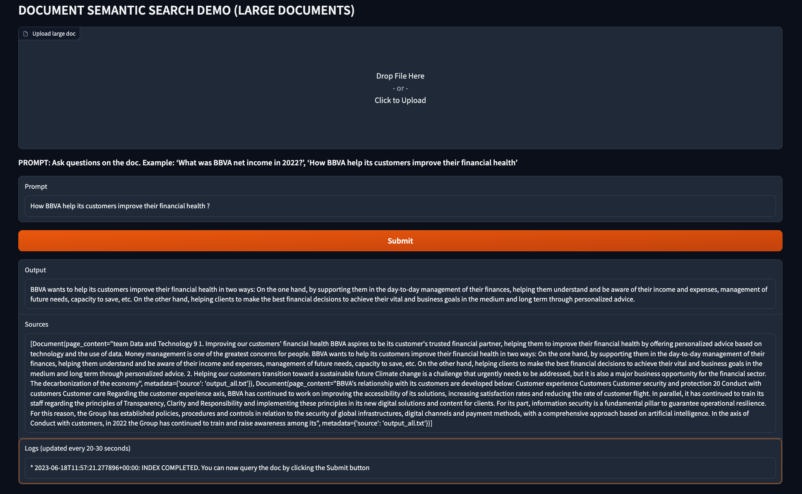

# Q&A on large unstructured documents with Vertex AI LLM, Chroma, langChain and Document AI OCR

The repo includes a [Gradio app](https://gradio.app/) to ask large docs by showing the combined capabilities of Vertex LLM models, a vector store like [Chroma](https://github.com/chroma-core/chroma), [langChain](https://github.com/hwchase17/langchain) and [Google Cloud Document AI OCR](https://cloud.google.com/document-ai/docs/samples/documentai-process-ocr-document#documentai_process_ocr_document-python). So, basically this repo implements a semantic search on large and unstructured documents.

The sample we will use is the public 2022 BBVA annual report (in English), a 564-page pdf that can be downloaded from [here](https://shareholdersandinvestors.bbva.com/wp-content/uploads/2023/03/Annual-Report-BBVA_2022_ENG.pdf). You can replace this doc with any other, like mortgages or any other large documents in the Finance and Insurance industry, even if they contain images or scanned information. 
    



## Document AI OCR (batch processing)

The first step is to download the public document and uploading into GCS, since this is required for OCR batch processing. Refer to constant `gcs_input_uri` in `local/ocr_batch.py` and upload the pdf file in GCS .

Why using Document AI OCR and not open-source tools like `PyPDF` to manage the document ? 

The reason is to be able also to process a document containing photos or scanning, since `PyPDF` and other similar tools will not detect anything even if the extension is `.pdf`.


Therefore, to extract the text from a photo or a scanned documents, you must use OCR tools like Document AI OCR. [Google Cloud Document AI](https://cloud.google.com/document-ai/docs) is a document understanding solution that takes unstructured data (e.g. documents, emails, invoices, forms, etc.) and makes the data easier to understand, analyze, and consume. One of the pre-trained models performs **Optical Character Recognition (OCR)**, which is the one we will use in this post. According to [this paper](http://dx.doi.org/10.1007/s42001-021-00149-1), Document AI OCR from Google outperforms other OCR solutions available.

Document AI OCR parser supports **online and batch processing**. Since we are dealing with large documents (more than 15 pages, which is the current limit for online processing), we will be using batch mode.


The script `local/ocr_batch.py` extracts text from a public doc, in this case the English version of the 2002 BBVA annual report (publicly available), a document with 564 pages. Since the extraction by Document AI OCR is in multiple chunks, they must be merged in a single file `output_all.txt` which is also generated by the same script.


## Indexing and retrieval 

Once you get the OCR text `output_all.txt` from the first step, you must create the index in Chroma (note the store is done persistently), by executing `python3 create_index_chroma.py`:

```sh
cd local
python3 create_index_chroma.py
```

To launch the retrieval, launch `python3 retrieval_chroma.py`. This script uses Retrieval QA chain to recover the blocks closer to the query, and a Vertex LLM model to write the output to the user.


## Full application in Gradio

The Gradio app will implement the full cycle described above in a single app:

1. Load a pdf file
2. Perform batch processing with Document AI OCR parser, converting to text.
3. Create the index with Chroma.
4. The user can then write the query, and the Retrieval QA chain will recover the blocks closer to the query. A Vertex LLM model will write the output to the user.

> NOTE: the whole process can take up to 30 minutes.

Refer to [this Medium post](https://medium.com/google-cloud/generative-ai-palm-2-model-deployment-with-cloud-run-54e8a398b24b) on how to set the Gradio app with minimum permissions. On top of those permissions, you will need for this app the following: `Private Logs Viewer`and `Storage Admin` (crete buckets) and `Document AI Admin`. To build and deploy the [Gradio app](https://gradio.app/) in [Cloud Run](https://cloud.google.com/run/docs/quickstarts/deploy-container), execute the following commands.

Note authentication is disabled and the service account in the one configured earlier:

```sh
PROJECT_ID=<REPLACE_WITH_YOUR_PROJECT_ID>
REGION=<REPLACE_WITH_YOUR_GCP_REGION_NAME>
AR_REPO=<REPLACE_WITH_YOUR_AR_REPO_NAME>
SERVICE_NAME=docai-large

gcloud artifacts repositories create $AR_REPO --location=$REGION --repository-format=Docker
gcloud auth configure-docker $REGION-docker.pkg.dev
gcloud builds submit --tag $REGION-docker.pkg.dev/$PROJECT_ID/$AR_REPO/$SERVICE_NAME
gcloud run deploy $SERVICE_NAME --port 7860 --image $REGION-docker.pkg.dev/$PROJECT_ID/$AR_REPO/$SERVICE_NAME --service-account=cloud-run-llm@$PROJECT_ID.iam.gserviceaccount.com --allow-unauthenticated --region=europe-west4 --platform=managed  --project=$PROJECT_ID
```


## References

[1] YouTube video: [Generative AI on Google Cloud](https://youtu.be/Q1zF9pF6flw)      
[2] YouTube video: [Build, tune, and deploy foundation models with Vertex AI](https://youtu.be/yg2yHIKQ7oM)     
[3] YouTube video: [Build, tune, and deploy foundation models with Generative AI Support in Vertex AI](https://www.youtube.com/watch?v=-2rQ_AcQMF8)      
